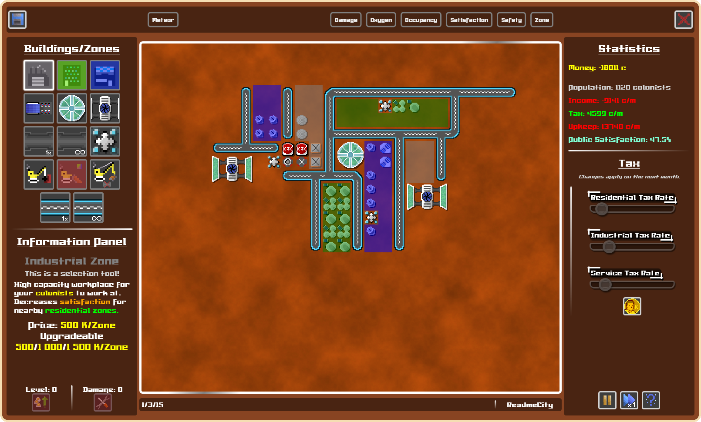
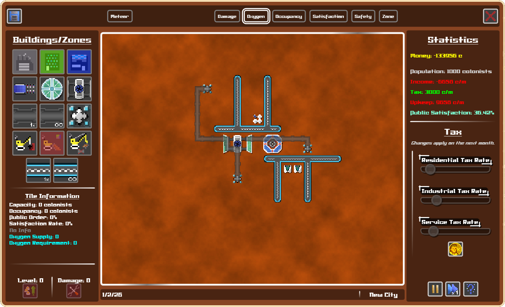

# KFCity

## Magyar leírás
Ez a projekt az ELTE Szoftvertechnológia 2023/2. kurzusára készített játék, egy városépítő szimulátor.

A játék futurisztikus témában lett tervezve, ennek megfelelően a cél egy marsi kolónia létesítése és fenntartása. Mivel a marsi levegő nem a legmegfelelőbb, szükség van oxigéntermelésre és annak megfelelő szétterjesztésére a város területén. Ennek és ehhez hasonló mechanikák kitapasztalása és ezáltal a város minél hatékonyabb fenntartása a játék célja.

## English description
This project was made for ELTE's 2023/2. semester's Softwaretechnology course. The task was to make a city building simulator.

The game is set in a futuristic theme, where you have to build and sustain a Martian colony. Since the air is not the most human-friendly, there's a need to generate oxygen and to diffuse it evenly on the area of the city. Learning how to be the most efficient at this and other similarly complex mechanics is the key to sustaining your city well.